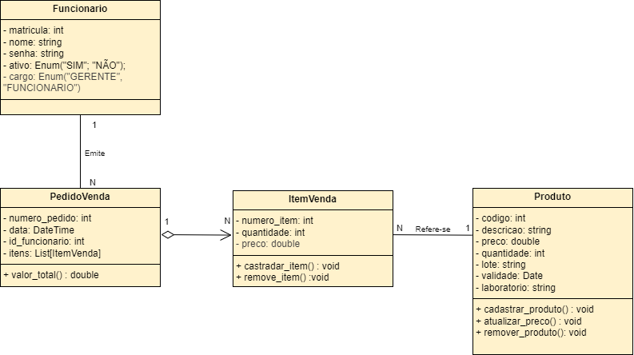
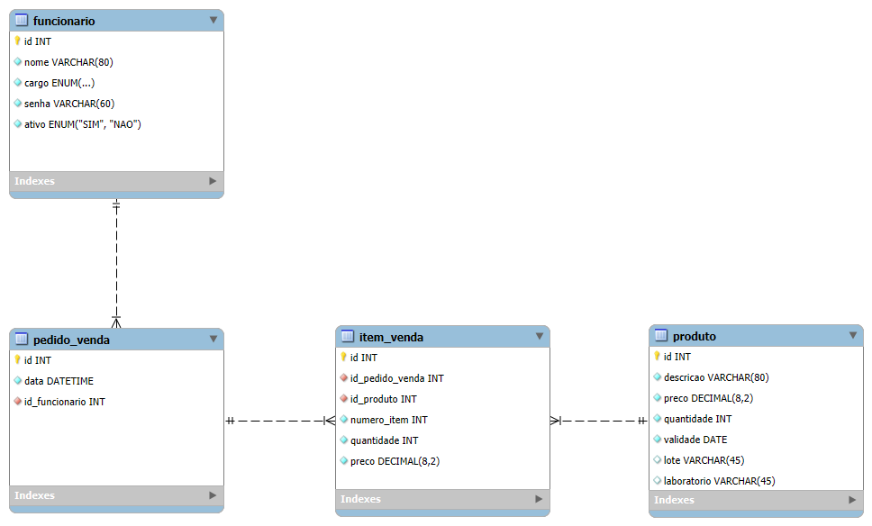

## 4. Projeto da Solução

Pré-requisitos: <a href="3-Modelagem-Processos-Negócio.md"> Modelagem do Processo de Negocio</a>

## 4.1. Arquitetura da solução

......  COLOQUE AQUI O SEU TEXTO E O DIAGRAMA DE ARQUITETURA .......

 Inclua um diagrama da solução e descreva os módulos e as tecnologias
 que fazem parte da solução. Discorra sobre o diagrama.
 
 **Exemplo do diagrama de Arquitetura**:
 
 
 

### 4.2. Protótipos de telas

Visão geral da interação do usuário pelas telas do sistema e protótipo interativo das telas com as funcionalidades que fazem parte do sistema (wireframes).

## Diagrama de Classes

O diagrama de classes ilustra graficamente como será a estrutura do software, e como cada uma das classes da sua estrutura estarão interligadas. Essas classes servem de modelo para materializar os objetos que executarão na memória.

As referências abaixo irão auxiliá-lo na geração do artefato “Diagrama de Classes”.

> - [Diagramas de Classes - Documentação da IBM](https://www.ibm.com/docs/pt-br/rational-soft-arch/9.6.1?topic=diagrams-class)
> - [O que é um diagrama de classe UML? | Lucidchart](https://www.lucidchart.com/pages/pt/o-que-e-diagrama-de-classe-uml)

## Modelo ER

### 4.3. Modelo de dados

O desenvolvimento da solução proposta requer a existência de bases de dados que permitam efetuar os cadastros de dados e controles associados aos processos identificados, assim como recuperações.
Utilizando a notação do DER (Diagrama Entidade e Relacionamento), elaborem um modelo, na ferramenta visual indicada na disciplina, que contemple todas as entidades e atributos associados às atividades dos processos identificados. Deve ser gerado um único DER que suporte todos os processos escolhidos, visando, assim, uma base de dados integrada. O modelo deve contemplar, também, o controle de acesso de usuários (partes interessadas dos processos) de acordo com os papéis definidos nos modelos do processo de negócio.
_Apresente o modelo de dados por meio de um modelo relacional que contemple todos os conceitos e atributos apresentados na modelagem dos processos._

#### 4.3.1 Modelo ER

O Modelo ER representa através de um diagrama como as entidades (coisas, objetos) se relacionam entre si na aplicação interativa.]

As referências abaixo irão auxiliá-lo na geração do artefato “Modelo ER”.

> - [Como fazer um diagrama entidade relacionamento | Lucidchart](https://www.lucidchart.com/pages/pt/como-fazer-um-diagrama-entidade-relacionamento)

 

#### 4.3.2 Esquema Relacional

O Esquema Relacional corresponde à representação dos dados em tabelas juntamente com as restrições de integridade e chave primária.
 
As referências abaixo irão auxiliá-lo na geração do artefato “Esquema Relacional”.

> - [Criando um modelo relacional - Documentação da IBM](https://www.ibm.com/docs/pt-br/cognos-analytics/10.2.2?topic=designer-creating-relational-model)

#### 4.3.3 Modelo Físico

Insira aqui o script de criação das tabelas do banco de dados.

Veja um exemplo:

<code>

-- Schema farmacia

-- Schema farmacia
CREATE SCHEMA IF NOT EXISTS `farmacia` DEFAULT CHARACTER SET utf8 ;
USE `farmacia` ;

-- Table `farmacia`.`fornecedor`
CREATE TABLE IF NOT EXISTS `farmacia`.`fornecedor` (
  `id` INT NOT NULL AUTO_INCREMENT,
  `descricao` VARCHAR(80) NOT NULL,
  `cnpj` VARCHAR(20) NOT NULL,
  `telefone` VARCHAR(11) NOT NULL,
  `estado` CHAR(2) NULL,
  `cidade` VARCHAR(45) NULL,
  `bairro` VARCHAR(45) NULL,
  `logradouro` VARCHAR(45) NULL,
  PRIMARY KEY (`id`));

-- Table `farmacia`.`laboratorio`
CREATE TABLE IF NOT EXISTS `farmacia`.`laboratorio` (
  `id` INT NOT NULL AUTO_INCREMENT,
  `descricao` VARCHAR(80) NOT NULL,
  `cnpj` VARCHAR(20) NOT NULL,
  PRIMARY KEY (`id`));

-- Table `farmacia`.`produto`
CREATE TABLE IF NOT EXISTS `farmacia`.`produto` (
  `id` INT NOT NULL AUTO_INCREMENT,
  `descricao` VARCHAR(80) NOT NULL,
  `preco` DECIMAL(8,2) NOT NULL,
  `id_laboratorio` INT NULL,
  PRIMARY KEY (`id`),
  INDEX `fk_produto_1_idx` (`id_laboratorio` ASC) VISIBLE,
  CONSTRAINT `fk_produto_1`
    FOREIGN KEY (`id_laboratorio`)
    REFERENCES `farmacia`.`laboratorio` (`id`)
    ON DELETE RESTRICT
    ON UPDATE NO ACTION);

-- Table `farmacia`.`fornecimento`
CREATE TABLE IF NOT EXISTS `farmacia`.`fornecimento` (
  `id` INT NOT NULL AUTO_INCREMENT,
  `id_fornecedor` INT NOT NULL,
  `id_produto` INT NOT NULL,
  PRIMARY KEY (`id`),
  INDEX `codigo_produto_idx` (`id_produto` ASC) VISIBLE,
  CONSTRAINT `fk_fornecimento_1`
    FOREIGN KEY (`id_fornecedor`)
    REFERENCES `farmacia`.`fornecedor` (`id`)
    ON DELETE RESTRICT
    ON UPDATE NO ACTION,
  CONSTRAINT `fk_fornecimento_2`
    FOREIGN KEY (`id_produto`)
    REFERENCES `farmacia`.`produto` (`id`)
    ON DELETE RESTRICT
    ON UPDATE NO ACTION);

-- Table `farmacia`.`funcionario`
CREATE TABLE IF NOT EXISTS `farmacia`.`funcionario` (
  `id` INT NOT NULL AUTO_INCREMENT,
  `nome` VARCHAR(80) NOT NULL,
  `cargo` ENUM("GERENTE", "EMPREGADO") NOT NULL,
  PRIMARY KEY (`id`));

-- Table `farmacia`.`pedido_compra`
CREATE TABLE IF NOT EXISTS `farmacia`.`pedido_compra` (
  `id` INT NOT NULL AUTO_INCREMENT,
  `data` DATETIME NOT NULL,
  `id_funcionario` INT NOT NULL,
  PRIMARY KEY (`id`),
  INDEX `matricula_funcionario_idx` (`id_funcionario` ASC) VISIBLE,
  CONSTRAINT `fk_pedido_compra_1`
    FOREIGN KEY (`id_funcionario`)
    REFERENCES `farmacia`.`funcionario` (`id`)
    ON DELETE RESTRICT
    ON UPDATE NO ACTION);

-- Table `farmacia`.`item_compra`
CREATE TABLE IF NOT EXISTS `farmacia`.`item_compra` (
  `id_pedido_compra` INT NOT NULL,
  `id_fornecimento` INT NOT NULL,
  `numero` INT NOT NULL,
  `quantidade` INT NOT NULL,
  `preco` DECIMAL(8,2) NOT NULL,
  INDEX `numero_pedido_idx` (`id_pedido_compra` ASC) VISIBLE,
  INDEX `codigo_fornecimento_idx` (`id_fornecimento` ASC) VISIBLE,
  PRIMARY KEY (`id_pedido_compra`, `id_fornecimento`),
  CONSTRAINT `fk_item_compra_1`
    FOREIGN KEY (`id_pedido_compra`)
    REFERENCES `farmacia`.`pedido_compra` (`id`)
    ON DELETE RESTRICT
    ON UPDATE NO ACTION,
  CONSTRAINT `fk_item_compra_2`
    FOREIGN KEY (`id_fornecimento`)
    REFERENCES `farmacia`.`fornecimento` (`id`)
    ON DELETE RESTRICT
    ON UPDATE NO ACTION);

-- Table `farmacia`.`pedido_venda`
CREATE TABLE IF NOT EXISTS `farmacia`.`pedido_venda` (
  `id` INT NOT NULL AUTO_INCREMENT,
  `data` DATETIME NOT NULL,
  `id_funcionario` INT NOT NULL,
  PRIMARY KEY (`id`),
  INDEX `fk_matricula_funcionario_idx` (`id_funcionario` ASC) VISIBLE,
  CONSTRAINT `fk_pedido_venda_1`
    FOREIGN KEY (`id_funcionario`)
    REFERENCES `farmacia`.`funcionario` (`id`)
    ON DELETE RESTRICT
    ON UPDATE NO ACTION);

-- Table `farmacia`.`item_venda`
CREATE TABLE IF NOT EXISTS `farmacia`.`item_venda` (
  `id_pedido_venda` INT NOT NULL,
  `id_produto` INT NOT NULL,
  `numero` INT NOT NULL,
  `quantidade` INT NOT NULL,
  `preco` DECIMAL(8,2) NOT NULL,
  INDEX `numero_pedido_idx` (`id_pedido_venda` ASC) VISIBLE,
  INDEX `codigo_produto_idx` (`id_produto` ASC) VISIBLE,
  PRIMARY KEY (`id_pedido_venda`, `id_produto`),
  CONSTRAINT `fk_item_venda_1`
    FOREIGN KEY (`id_pedido_venda`)
    REFERENCES `farmacia`.`pedido_venda` (`id`)
    ON DELETE RESTRICT
    ON UPDATE NO ACTION,
  CONSTRAINT `fk_item_venda_2`
    FOREIGN KEY (`id_produto`)
    REFERENCES `farmacia`.`produto` (`id`)
    ON DELETE RESTRICT
    ON UPDATE NO ACTION);

-- Table `farmacia`.`estoque`
CREATE TABLE IF NOT EXISTS `farmacia`.`estoque` (
  `id` INT NOT NULL AUTO_INCREMENT,
  `quantidade` INT NOT NULL,
  `validade` DATE NOT NULL,
  `lote` VARCHAR(20) NULL,
  `id_produto` INT NOT NULL,
  PRIMARY KEY (`id`),
  INDEX `fk_estoque_1_idx` (`id_produto` ASC) VISIBLE,
  CONSTRAINT `fk_estoque_1`
    FOREIGN KEY (`id_produto`)
    REFERENCES `farmacia`.`produto` (`id`)
    ON DELETE RESTRICT
    ON UPDATE NO ACTION);

</code>

Este script deverá ser incluído em um arquivo .sql na pasta src\bd.

### 4.4. Tecnologias

_Descreva qual(is) tecnologias você vai usar para resolver o seu problema, ou seja, implementar a sua solução. Liste todas as tecnologias envolvidas, linguagens a serem utilizadas, serviços web, frameworks, bibliotecas, IDEs de desenvolvimento, e ferramentas._

Apresente também uma figura explicando como as tecnologias estão relacionadas ou como uma interação do usuário com o sistema vai ser conduzida, por onde ela passa até retornar uma resposta ao usuário.

| **Dimensão**   | **Tecnologia**  |
| ---            | ---             |
| Front end      | HTML+CSS+JS     |
| Back end       | GitHub Pages    |
| API            | Replit          |
| SGBD           | MySQL           |
| Servidor BD    | FreeSQLDatabase |
| Deploy         | Github Pages    |
