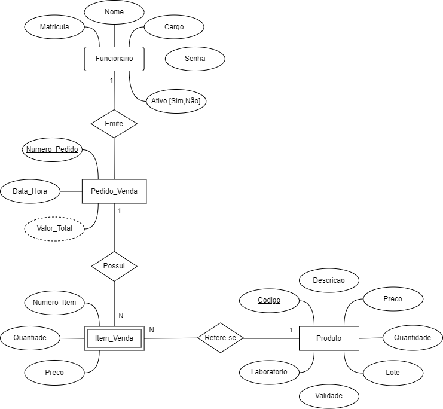

## 4. Projeto da Solução

Pré-requisitos: <a href="3-Modelagem-Processos-Negócio.md"> Modelagem do Processo de Negocio</a>

## 4.1. Arquitetura da solução

A arquitetura do sistema é baseada no modelo cliente-servidor e utiliza tecnologias modernas para garantir desempenho, escalabilidade e facilidade de manutenção. O frontend é composto por páginas web desenvolvidas com HTML, CSS e JavaScript, acessadas diretamente pelo navegador. Esse conteúdo estático é hospedado no GitHub Pages, o que facilita o deploy e garante alta disponibilidade. O navegador também faz uso do Local Storage para armazenar dados do usuário e cache de autenticação, proporcionando uma experiência mais fluida e rápida.

No backend, a aplicação utiliza o framework FastAPI para expor uma API REST, permitindo a comunicação entre o frontend e o banco de dados. A camada de persistência é gerenciada com SQLAlchemy, que facilita a interação com o banco de dados relacional. O banco de dados utilizado é o MySQL, hospedado na plataforma FreeSQLDatabase, e é acessado exclusivamente pela API, garantindo maior segurança e controle sobre os dados.

Essa estrutura separa claramente as responsabilidades entre as camadas da aplicação, favorecendo a modularidade e a escalabilidade do sistema como um todo.

 
 
 

### 4.2. Protótipos de telas

Visão geral da interação do usuário pelas telas do sistema e protótipo interativo das telas com as funcionalidades que fazem parte do sistema (wireframes).
PRINCIPAIS TELAS

### 1- Tela de Login onde funcionário informa matrícula, cargo e senha

### 2- Tela Inicial para escolher a função que quer acessar

### 3- Tela para gerenciar os usuários

### 4- Tela para gerenciar os produtos

### 5- Tela para realização de vendas

### 6- Tela de visualização dos relatórios

## Diagrama de Classes

O diagrama de classes ilustra graficamente como será a estrutura do software, e como cada uma das classes da sua estrutura estarão interligadas. Essas classes servem de modelo para materializar os objetos que executarão na memória.

## Modelo ER

### 4.3. Modelo de dados

# Tabela de Entidades e Relacionamentos

| Entidade          | Atributos                                                | Relacionamentos                                                                  |
|-------------------|----------------------------------------------------------|----------------------------------------------------------------------------------|
| Funcionário       | matrícula, nome, cargo, senha, ativo                     | Solicita pedidos de compra e emite pedidos de venda (1:N)                        |
| Pedido_Venda      | número, data, valor_total (calculado), id_funcionario    | Possui itens de venda (1:N)                                                      |
| Item_Venda        | número, quantidade, preço, id_pedido, id_produto         | Pertence a um pedido de venda (N:1), refere-se a um produto (N:1)               |
| Produto           | código, descrição, preço, quantidade, validade, lote, laboratório |          |

**Notas:**
- O valor total dos pedidos é **derivado** da soma dos itens.
- O relacionamento **N:M** entre Produto e Fornecedor é resolvido pela entidade associativa **Fornecimento**.
- Os produtos podem estar associados a **vários estoques** e **vários pedidos**.

#### 4.3.1 Modelo ER

O Modelo ER representa através de um diagrama como as entidades (coisas, objetos) se relacionam entre si na aplicação interativa.

 

#### 4.3.2 Esquema Relacional

O Esquema Relacional corresponde à representação dos dados em tabelas juntamente com as restrições de integridade e chave primária.

#### 4.3.3 Modelo Físico

Insira aqui o script de criação das tabelas do banco de dados.

Veja um exemplo:

<code>

 -- Schema farmacia
CREATE SCHEMA IF NOT EXISTS `farmacia` DEFAULT CHARACTER SET utf8 ;
USE `farmacia` ;

-- Table `farmacia`.`produto`
CREATE TABLE IF NOT EXISTS `farmacia`.`produto` (
  `id` INT NOT NULL AUTO_INCREMENT,
  `descricao` VARCHAR(80) NOT NULL,
  `preco` DECIMAL(8,2) NOT NULL,
  `quantidade` INT NOT NULL,
  `validade` DATE NOT NULL,
  `lote` VARCHAR(45) NULL,
  `laboratorio` VARCHAR(45) NULL,
  PRIMARY KEY (`id`));

-- Table `farmacia`.`funcionario`
CREATE TABLE IF NOT EXISTS `farmacia`.`funcionario` (
  `id` INT NOT NULL AUTO_INCREMENT,
  `nome` VARCHAR(80) NOT NULL,
  `cargo` ENUM("GERENTE", "EMPREGADO") NOT NULL,
  `senha` VARCHAR(60) NOT NULL,
  `ativo` ENUM("SIM", "NAO") NOT NULL,
  PRIMARY KEY (`id`),
  UNIQUE INDEX `nome_UNIQUE` (`nome` ASC));

-- Table `farmacia`.`pedido_venda`
CREATE TABLE IF NOT EXISTS `farmacia`.`pedido_venda` (
  `id` INT NOT NULL AUTO_INCREMENT,
  `data` DATETIME NOT NULL,
  `id_funcionario` INT NOT NULL,
  PRIMARY KEY (`id`),
  INDEX `fk_matricula_funcionario_idx` (`id_funcionario` ASC),
  CONSTRAINT `fk_pedido_venda_1`
    FOREIGN KEY (`id_funcionario`)
    REFERENCES `farmacia`.`funcionario` (`id`)
    ON DELETE RESTRICT
    ON UPDATE NO ACTION);

-- Table `farmacia`.`item_venda`
CREATE TABLE IF NOT EXISTS `farmacia`.`item_venda` (
  `id` INT NOT NULL AUTO_INCREMENT,
  `id_pedido_venda` INT NOT NULL,
  `id_produto` INT NOT NULL,
  `numero_item` INT NOT NULL,
  `quantidade` INT NOT NULL,
  `preco` DECIMAL(8,2) NOT NULL,
  INDEX `numero_pedido_idx` (`id_pedido_venda` ASC),
  PRIMARY KEY (`id`),
  INDEX `fk_item_venda_2_idx` (`id_produto` ASC),
  CONSTRAINT `fk_item_venda_1`
    FOREIGN KEY (`id_pedido_venda`)
    REFERENCES `farmacia`.`pedido_venda` (`id`)
    ON DELETE RESTRICT
    ON UPDATE NO ACTION,
  CONSTRAINT `fk_item_venda_2`
    FOREIGN KEY (`id_produto`)
    REFERENCES `farmacia`.`produto` (`id`)
    ON DELETE NO ACTION
    ON UPDATE NO ACTION);

</code>

Este script deverá ser incluído em um arquivo .sql na pasta src\bd.

### 4.4. Tecnologias

_Descreva qual(is) tecnologias você vai usar para resolver o seu problema, ou seja, implementar a sua solução. Liste todas as tecnologias envolvidas, linguagens a serem utilizadas, serviços web, frameworks, bibliotecas, IDEs de desenvolvimento, e ferramentas._

Apresente também uma figura explicando como as tecnologias estão relacionadas ou como uma interação do usuário com o sistema vai ser conduzida, por onde ela passa até retornar uma resposta ao usuário.

| **Dimensão**   | **Tecnologia**  |
| ---            | ---             |
| Front end      | HTML+CSS+JS     |
| Back end       | GitHub Pages    |
| API            | Replit          |
| SGBD           | MySQL           |
| Servidor BD    | FreeSQLDatabase |
| Deploy         | Github Pages    |
