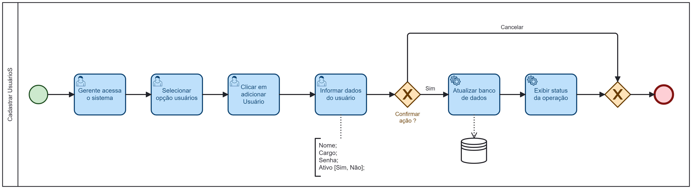

### 3.3.1 Processo 1 – CADASTRAR USUÁRIOS

O processo se inicia com um gerente acessando o sistema e selecionando a opção "Usuários", em seguida clica em adicionar usuário e depois informa os dados:
* Nome
* Cargo
* Senha
* Status: ativo (valor padrão) ou inativo

O gerente confirma a ação deseja, o sistema atualiza as informações no banco de dados, informa o status da operação e o processo é finalizado. Caso escolha a opção cancelar, o processo finaliza sem alterar dados no sistema.

#### Detalhamento das atividades

**Atividade 1 - Acessar o Sistema**

| **Campo**       | **Tipo**         | **Restrições**      | **Valor default** |
| ---             | ---              | ---                 | ---               |
| [Matrícula]     | [Caixa de Texto] | Gerada pelo sistema | ---     |
| [Senha]         | [Caixa de Texto] | --- | ---     |

| **Comandos**    |  **Destino**     | **Tipo**                 |
| ---             | ---              | ---                      |
| [Entrar]        | Tela Inicial (Selecionar processo)     | default      |

**Atividade 2 - Selecionar Opção Usuários**

| **Comandos**         |  **Destino**                   | **Tipo**            |
| ---                  | ---                            | ---                 |
| [Usuários]           | Adicionar Usuário      | default  |

**Atividade 3 - Clicar em Adicionar Usuário**

| **Comandos**         |  **Destino**                   | **Tipo**            |
| ---                  | ---                            | ---                 |
| [Adicionar Usuário]  | Informar dados do usuário      | default  |

**Atividade 4 - Informar Dados do Usuário**
| **Campo**       | **Tipo**         | **Restrições** | **Valor default** |
| ---             | ---              | ---            | ---               |
| [Nome]          | [Caixa de Texto] | Não pode ser vazio |                   |
| [Cargo]         | [Seleção Única]  | Gerente, Funcionário | Funcionário |
| [Senha]         | [Caixa de Texto] | 8 caracteres | Não se aplica |
| [Ativo]         | [Seleção Única]  | Sim, Não | Sim |

| **Comandos**         |  **Destino**                   | **Tipo**            |
| ---                  | ---                            | ---                 |
| [Cadastrar]          | Fim do Processo                |  default            |
| [Cancelar]           | Fim do Processo                |  cancelar           |
