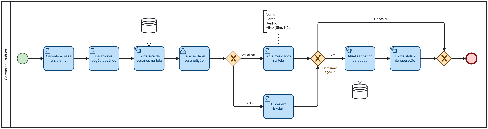

### 3.3.2 Processo 2 – GERENCIAR USUÁRIOS

O processo se inicia com um gerente acessando o sistema e selecionando a opção "Gerenciar Usuários", em seguida pesquisa o usuário desejado na lista informada pelo sistema, clica em editar, o sistema exibe os dados do usuário permitindo alteração. Os campos disponíveis são:
* Nome
* Cargo
* Senha
* Status: ativo (valor padrão) ou inativo

O gerente atualiza os dados, clica em confirmar, o sistema atualiza as informações no banco de dados, informa o status da operação e o processo é finalizado. Caso escolha a opção cancelar, o processo finaliza sem alterar dados no sistema.

#### Detalhamento das atividades

_Descreva aqui cada uma das propriedades das atividades do processo. 
Devem estar relacionadas com o modelo de processo apresentado anteriormente._

_Os tipos de dados a serem utilizados são:_

_* **Área de texto** - campo texto de múltiplas linhas_

_* **Caixa de texto** - campo texto de uma linha_

_* **Número** - campo numérico_

_* **Data** - campo do tipo data (dd-mm-aaaa)_

_* **Hora** - campo do tipo hora (hh:mm:ss)_

_* **Data e Hora** - campo do tipo data e hora (dd-mm-aaaa, hh:mm:ss)_

_* **Imagem** - campo contendo uma imagem_

_* **Seleção única** - campo com várias opções de valores que são mutuamente exclusivas (tradicional radio button ou combobox)_

_* **Seleção múltipla** - campo com várias opções que podem ser selecionadas mutuamente (tradicional checkbox ou listbox)_

_* **Arquivo** - campo de upload de documento_

_* **Link** - campo que armazena uma URL_

_* **Tabela** - campo formado por uma matriz de valores_

**Atividade 1 - Acessar o Sistema**

| **Campo**       | **Tipo**         | **Restrições**      | **Valor default** |
| ---             | ---              | ---                 | ---               |
| [Matrícula]     | [Caixa de Texto] | Gerada pelo sistema | ---     |
| [Senha]         | [Caixa de Texto] | --- | ---     |

| **Comandos**    |  **Destino**     | **Tipo**                 |
| ---             | ---              | ---                      |
| [Entrar]        | Tela Inicial (Selecionar processo)     | default      |

**Atividade 2 - Selecionar Opção Usuários**
| **Campo**       | **Tipo**         | **Restrições** | **Valor default** |
| ---             | ---              | ---            | ---               |
| [Não se aplica] | [Não se aplica]  |                |                   |

| **Comandos**         |  **Destino**                   | **Tipo**            |
| ---                  | ---                            | ---                 |
| [Usuários]           | Adicionar Usuário      | default  |

**Atividade 3 - Clicar em Editar Usuário (Lápis) **
| **Campo**       | **Tipo**         | **Restrições** | **Valor default** |
| ---             | ---              | ---            | ---               |
| [Não se aplica] | [Não se aplica]  |                |                   |

| **Comandos**         |  **Destino**                   | **Tipo**            |
| ---                  | ---                            | ---                 |
| [Adicionar Usuário]  | Informar dados do usuário      | default  |

**Atividade 4 - Informar Dados do Usuário**
| **Campo**       | **Tipo**         | **Restrições** | **Valor default** |
| ---             | ---              | ---            | ---               |
| [Nome]          | [Caixa de Texto] | Não pode ser vazio |                   |
| [Cargo]         | [Seleção Única]  | Gerente, Funcionário | Funcionário |
| [Senha]         | [Caixa de Texto] | 8 caracteres | Não se aplica |
| [Ativo]         | [Seleção Única]  | Sim, Não | Sim |

| **Comandos**         |  **Destino**                   | **Tipo**            |
| ---                  | ---                            | ---                 |
| [Confirmar]          | Fim do Processo                |  default            |
| [Excluir Usuário]    | Fim do Processo                |  default            |
| [Cancelar]           | Fim do Processo                |  cancelar           |
