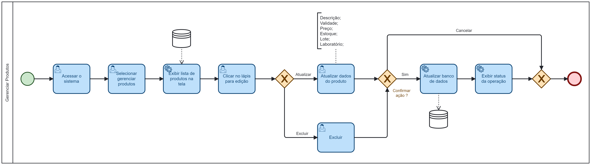

### 3.3.4 Processo 4 – GERENCIAR PRODUTOS

O processo se inicia com um funcionário (ou gerente) acessando o sistema e selecionando a opção "Produtos", em seguida pesquisa o produto desejado na lista informada pelo sistema, clica em editar, o sistema exibe os dados do produto permitindo alteração. Os campos disponíveis são:
* Descrição
* Preço
* Quantidade
* Lote
* Validade
* Laboratório

O funcionário pode atualizar os dados e em seguida clicar em confirmar, ou remover o produto clicando em excluir. O sistema atualiza as informações no banco de dados, informa o status da operação e o processo é finalizado. Caso escolha a opção cancelar, o processo finaliza sem alterar dados no sistema.

#### Detalhamento das atividades

**Atividade 1 - Acessar o Sistema**

| **Campo**       | **Tipo**         | **Restrições**      | **Valor default** |
| ---             | ---              | ---                 | ---               |
| [Matrícula]     | [Caixa de Texto] | Gerada pelo sistema | ---     |
| [Senha]         | [Caixa de Texto] | --- | ---     |

| **Comandos**    |  **Destino**     | **Tipo**                 |
| ---             | ---              | ---                      |
| [Entrar]        | Tela Inicial (Selecionar processo)     | default      |

**Atividade 2 - Selecionar Opção Produtos**

| **Comandos**         |  **Destino**                   | **Tipo**            |
| ---                  | ---                            | ---                 |
| [Produtos]           | Clicar em Editar Produto | default  |

**Atividade 3 - Clicar em Editar Produto (Lápis)**

| **Comandos**         |  **Destino**                   | **Tipo**            |
| ---                  | ---                            | ---                 |
| [Editar Produto]     | Informar dados do produto      | default  |

**Atividade 4 - Informar Dados do Produto**
| **Campo**       | **Tipo**         | **Restrições** | **Valor default** |
| ---             | ---              | ---            | ---               |
| [Descrição]          | [Caixa de Texto] | Não pode ser vazio |                   |
| [Validade]         | [Data]  | Não pode ser inferior à data atual | --- |
| [Preço]         | [Número] | Não poder negativo | --- |
| [Estoque]       | [Número]  | --- | --- |
| [Lote]       | [Caixa de Texto]  | --- | --- |
| [Laboratório]       | [Caixa de Texto]  | --- | --- |

| **Comandos**         |  **Destino**                   | **Tipo**            |
| ---                  | ---                            | ---                 |
| [Confirmar]          | Fim do Processo                |  default            |
| [Excluir Produto]    | Fim do Processo                |  Botão              |
| [Cancelar]           | Fim do Processo                |  cancelar           |

