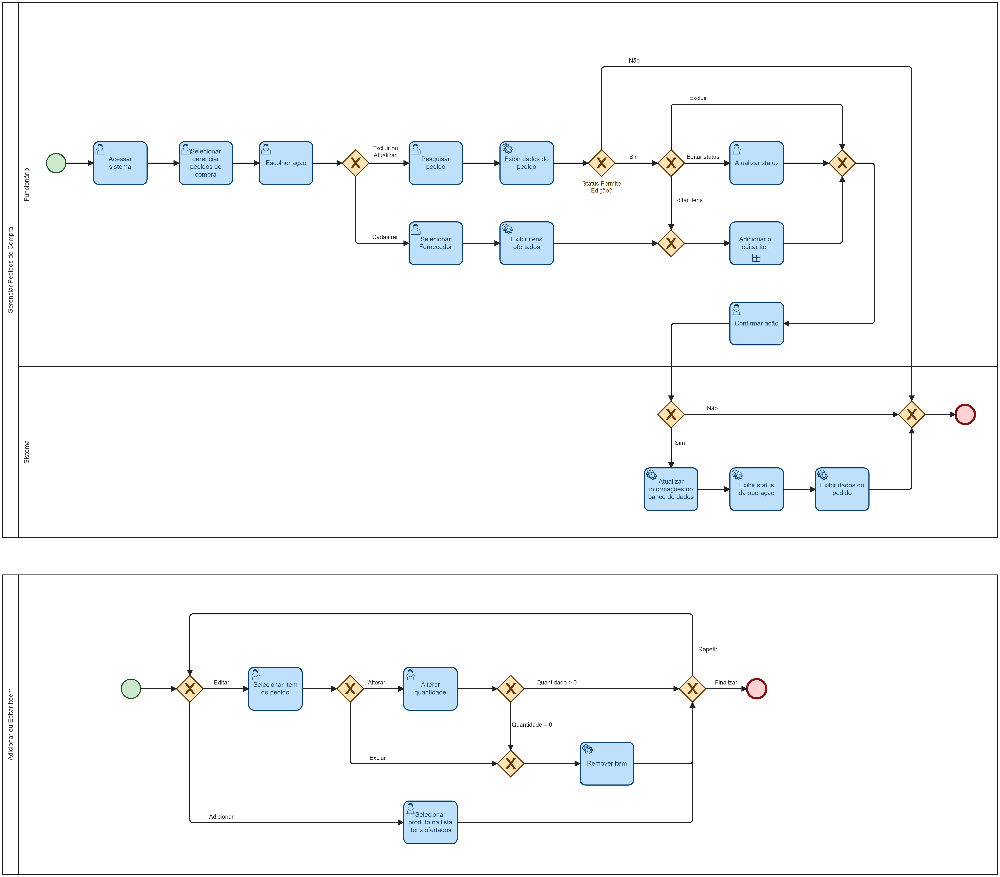

### 3.3.5 Processo 5 – GERENCIAR PEDIDOS DE COMPRA

O funcionário (ou gerente) acessa o sistema e clica na opção "Gerenciar Pedidos de Compra", em seguida escolhe a ação desejada na próxima tela:

* Cadastrar;
* Atualizar;
* Excluir (deleção lógica);

Para atualização ou exclusão é necessário pesquisar o pedido desejado.

Para cadastro, o funcionário seleciona o fornecedor desejado. Em seguida, o sistema exibe uma lista com o código e nome dos produtos ofertados pelo fornecedor. O funcionário seleciona os produtos a serem repostos e inclui no pedido.

Na atualização, o sistema exibe todos os itens do pedido e seu status conforme abaixo:
* Criado;
* Enviado para o cliente;
* Confirmado pelo cliente;
* Entregue;
* Cancelado;

O funcionário pode alterar o status do pedido, adicionar ou excluir novos itens caso o pedido esteja com status Criado.

O funcionário confirma a ação deseja, o sistema atualiza as informações no banco de dados, informa o status da operação, exibe os dados do pedido na tela e o processo é finalizado.

Na proposta de solução o funcionário deve gerar um PDF com os dados do pedido, enviar por e-mail ao fornecedor e atualizar o status do pedido no sistema. Não será implementada integração com envio de e-mails ou com sistemas externos.

#### Detalhamento das atividades

_Descreva aqui cada uma das propriedades das atividades do processo 2. 
Devem estar relacionadas com o modelo de processo apresentado anteriormente._

_Os tipos de dados a serem utilizados são:_

_* **Área de texto** - campo texto de múltiplas linhas_

_* **Caixa de texto** - campo texto de uma linha_

_* **Número** - campo numérico_

_* **Data** - campo do tipo data (dd-mm-aaaa)_

_* **Hora** - campo do tipo hora (hh:mm:ss)_

_* **Data e Hora** - campo do tipo data e hora (dd-mm-aaaa, hh:mm:ss)_

_* **Imagem** - campo contendo uma imagem_

_* **Seleção única** - campo com várias opções de valores que são mutuamente exclusivas (tradicional radio button ou combobox)_

_* **Seleção múltipla** - campo com várias opções que podem ser selecionadas mutuamente (tradicional checkbox ou listbox)_

_* **Arquivo** - campo de upload de documento_

_* **Link** - campo que armazena uma URL_

_* **Tabela** - campo formado por uma matriz de valores_

**Nome da atividade 1**

| **Campo**       | **Tipo**         | **Restrições** | **Valor default** |
| ---             | ---              | ---            | ---               |
| [Nome do campo] | [tipo de dados]  |                |                   |
| ***Exemplo:***  |                  |                |                   |
| login           | Caixa de Texto   | formato de e-mail |                |
| senha           | Caixa de Texto   | mínimo de 8 caracteres |           |

| **Comandos**         |  **Destino**                   | **Tipo** |
| ---                  | ---                            | ---               |
| [Nome do botão/link] | Atividade/processo de destino  | (default/cancel/  ) |
| ***Exemplo:***       |                                |                   |
| entrar               | Fim do Processo 1              | default           |
| cadastrar            | Início do proceso de cadastro  |                   |

**Nome da atividade 2**

| **Campo**       | **Tipo**         | **Restrições** | **Valor default** |
| ---             | ---              | ---            | ---               |
| [Nome do campo] | [tipo de dados]  |                |                   |
|                 |                  |                |                   |

| **Comandos**         |  **Destino**                   | **Tipo**          |
| ---                  | ---                            | ---               |
| [Nome do botão/link] | Atividade/processo de destino  | (default/cancel/  ) |
|                      |                                |                   |
