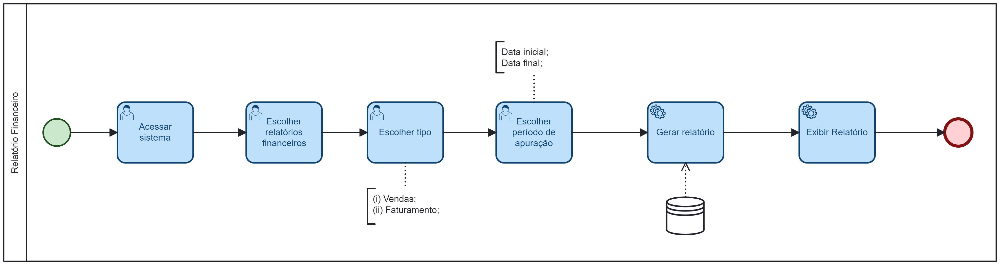

### 3.3.7 Processo 7 – RELATÓRIOS FINANCEIROS

O funcionário (ou gerente) acessa o sistema e clica na opção "Relatórios Financeiros", em seguida escolhe o tipo desejado na próxima tela:
* Vendas por período;
* Faturamento por período;

Caso o período não seja informado, será considerada a data atual. Em seguida o empregado deve confirmar a ação desejada, o sistema pesquisa as informações no banco de dados, gera o relatório, exibe os dados na tela e o processo é finalizado. Caso escolha a opção cancelar, o processo é finalizado.

#### Detalhamento das atividades

_Descreva aqui cada uma das propriedades das atividades do processo. 
Devem estar relacionadas com o modelo de processo apresentado anteriormente._

_Os tipos de dados a serem utilizados são:_

_* **Área de texto** - campo texto de múltiplas linhas_

_* **Caixa de texto** - campo texto de uma linha_

_* **Número** - campo numérico_

_* **Data** - campo do tipo data (dd-mm-aaaa)_

_* **Hora** - campo do tipo hora (hh:mm:ss)_

_* **Data e Hora** - campo do tipo data e hora (dd-mm-aaaa, hh:mm:ss)_

_* **Imagem** - campo contendo uma imagem_

_* **Seleção única** - campo com várias opções de valores que são mutuamente exclusivas (tradicional radio button ou combobox)_

_* **Seleção múltipla** - campo com várias opções que podem ser selecionadas mutuamente (tradicional checkbox ou listbox)_

_* **Arquivo** - campo de upload de documento_

_* **Link** - campo que armazena uma URL_

_* **Tabela** - campo formado por uma matriz de valores_

**Atividade 1 - Acessar o Sistema**

| **Campo**       | **Tipo**         | **Restrições**      | **Valor default** |
| ---             | ---              | ---                 | ---               |
| [Matrícula]     | [Caixa de Texto] | Gerada pelo sistema | ---     |
| [Senha]         | [Caixa de Texto] | --- | ---     |

| **Comandos**    |  **Destino**     | **Tipo**                 |
| ---             | ---              | ---                      |
| [Entrar]        | Tela Inicial (Selecionar processo)     | default      |

**Atividade 2 - Selecionar Opção Relatório Financeiro**
| **Campo**       | **Tipo**         | **Restrições** | **Valor default** |
| ---             | ---              | ---            | ---               |
| --- | ---  |                |                   |

| **Comandos**           | **Destino**                  | **Tipo**            |
|------------------------|------------------------------| ---                 |
| [Relatório Financeiro] | Tela de Relatório Financeiro | default  |

**Atividade 3 - Inserir termos para gerar o relatório em tempo real**
| **Campo**| **Tipo**| **Restrições** | **Valor default** |
| [inicio]| [caixa de texto]| num|6 meses atrás|
| [fim]| [caixa de texto] |num|data atual|

| **Comandos** |  **Destino**                   | **Tipo**           |
|------------| ---                            | ---                 |
|            |  |  |
