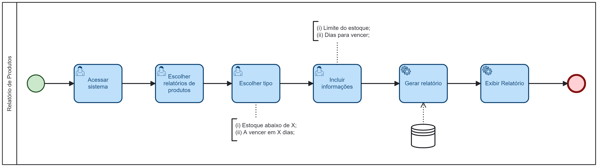

### 3.3.8 Processo 8– RELATÓRIOS DE PRODUTOS

O funcionário (ou gerente) acessa o sistema e clica na opção "Relatórios de Produtos", em seguida escolhe o tipo desejado na próxima tela:
* Produtos com quantidade igual ou inferior;
* Produtos a vencer;

O funcionário deve informar quantidade mínima caso selecione o relatório de quantidade, ou a data desejada caso escolha o relatório de produtos a vencer.

Em seguida o empregado deve confirmar a ação desejada, o sistema pesquisa as informações no banco de dados, gera o relatório e exibe na tela e o processo é finalizado. Caso escolha a opção cancelar, o processo é finalizado.

#### Detalhamento das atividades

**Atividade 1 - Acessar o Sistema**

| **Campo**       | **Tipo**         | **Restrições**      | **Valor default** |
| ---             | ---              | ---                 | ---               |
| [Matrícula]     | [Caixa de Texto] | Gerada pelo sistema | ---     |
| [Senha]         | [Caixa de Texto] | --- | ---     |

| **Comandos**    |  **Destino**     | **Tipo**                 |
| ---             | ---              | ---                      |
| [Entrar]        | Tela Inicial (Selecionar processo)     | default      |

**Atividade 2 - Selecionar Opção Relatório de Estoque**
| **Campo**       | **Tipo**         | **Restrições** | **Valor default** |
| ---             | ---              | ---            | ---               |
| --- | ---  |                |                   |

| **Comandos**           | **Destino**                  | **Tipo**            |
|------------------------|------------------------------| ---                 |
| [Relatório de Estoque] | Tela de Relatório de Estoque | default  |

**Atividade 3 - Inserir termos para gerar o relatório em tempo real**
| **Campo**| **Tipo**| **Restrições** | **Valor default** |
| [inicio]| [caixa de texto]| num|6 meses atrás|
| [fim]| [caixa de texto] |num|data atual|

| **Comandos** |  **Destino**                   | **Tipo**           |
|------------| ---                            | ---                 |
|            |  |  |
